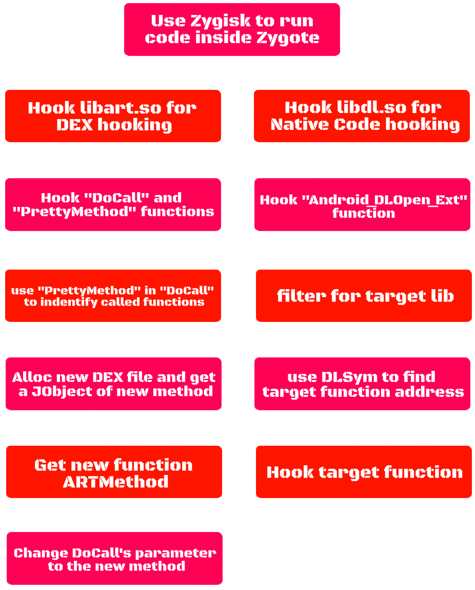
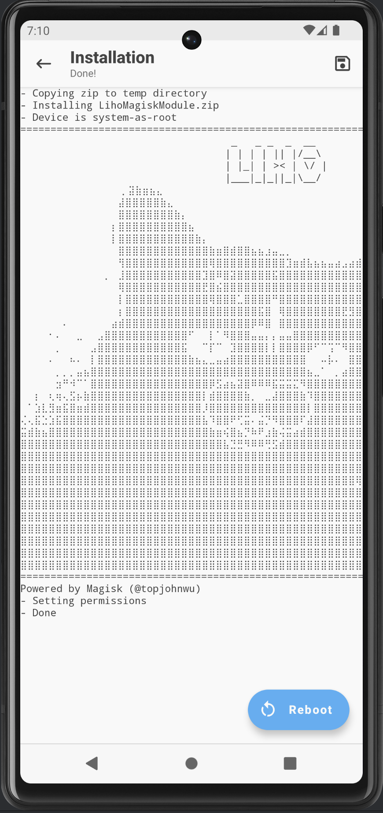
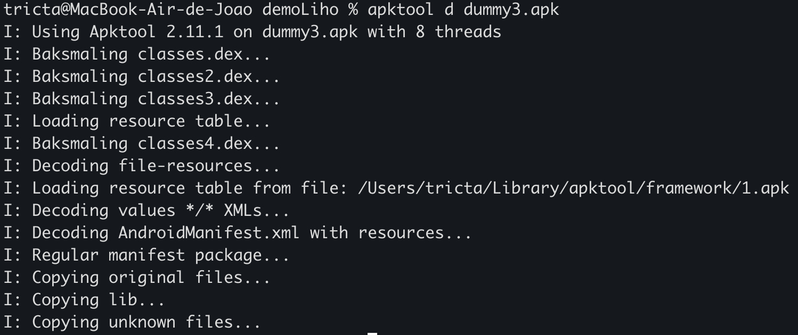
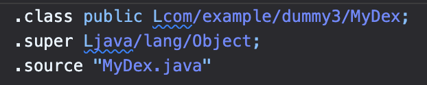
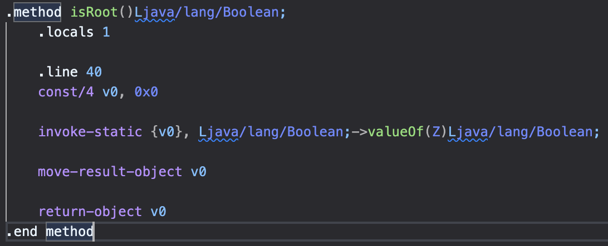
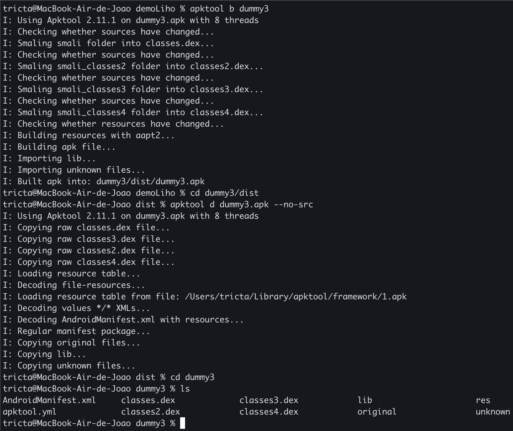
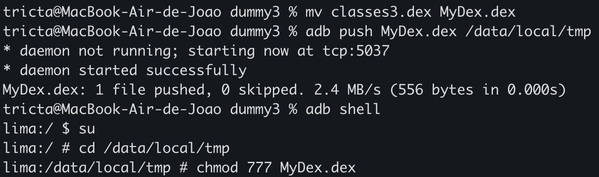
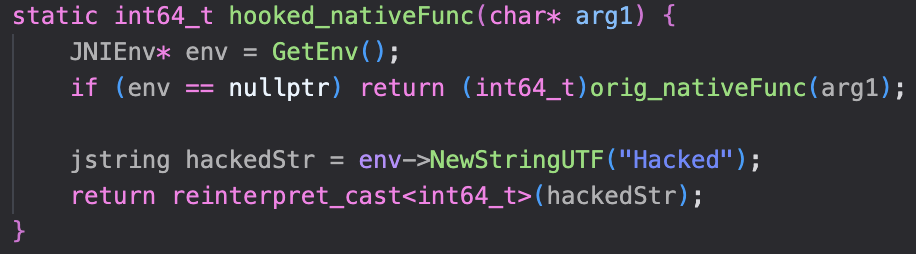

<div align="center">
  <a href="" rel="noopener">
 </a>
</div>

<div align="center">

[]()
[](https://github.com/Tricta/Liho/issues)
[](https://github.com/Tricta/Liho/pulls)
[](/LICENSE)

</div>

---

<p align="center"> Hooking tool for libart.so and libdl.so, enabling instrumentation of both DEX and native code on Android.
    <br> 
</p>

## 📝 Table of Contents

- [About](#about)
- [Prerequisites](#prerequisites)
- [Installing](#installing)
- [Usage](#usage)
- [Built Using](#built_using)
- [TODO](../TODO.md)
- [Acknowledgments](#acknowledgement)

## 🧐 About <a name = "about"></a>

Liho is a tool ported from my other project [Yaga](), that use hooks of android system components like libart.so and libdl.so, to enable instrumentation of both DEX and native code of applications on Android via zygote injection.

This approach stealthily bypasses Frida and debugger detections, traces method calls during app forks, and help to quick reversing and bypass protections.

You can see the overall flow in the diagram below:

<div align="center">
  
</div>

## ⚙️ Prerequisites

The project currently works only on ARM and ARM64 devices. Support for x86 and x86_64 is coming soon.

To build the module, run one of the setup scripts included in the project:
```
./setup arm64
adb push LihoMagiskModule.zip /sdcard/Download
```

## 📦 Installing

Having a mobile with Magisk, you just need to install the module and reboot your system:
<div align="center">
  
</div>

## 🎈 Usage <a name="usage"></a>

For use Liho, we just need to modify the ```main.cpp``` file. First, change the apk package name on the function ```set_apk_name``` to set our target.

```
set_apk_name("com.example.dummy3");
```

Now, we choose to use ```register_dex_hook``` for DEX methods that are non static or ```register_native_hook``` for native methods.

On ```register_dex_hook```, you need to pass the arguments in  order:
<ol>
<li>Package.Class.targetMethod</li>
<li>NewPackage.newClass</li>
<li>New Method</li>
<li>Signature</li>
<li>DEX File to find new method</li>
</ol>

```
register_dex_hook("com.example.dummy3.MainActivity.isRoot", "com.example.dummy3.mydex", "isRoot", "()Ljava/lang/Boolean;","mydex.dex");
```

To generate the DEX file you can follow this steps:
<ol>
<li>
Decompile the target apk:<br>
<div align="center">
  
</div>
</li>

<br>

<li>
Edit target class to new class name:<br>
<div align="center">
  
</div>
</li>

<br>

<li>
Edit target method:<br>
<div align="center">
  
</div>
</li>

<br>

<li>
Recompile and decompile it again with apktool flag <code>--no-src</code><br>
<div align="center">
  
</div>
</li>

<br>

<li>
Send file to <code>/data/local/tmp</code> and give read and write permissions:<br>
<div align="center">
  
</div>
</li>
</ol>

<br>

On ```register_native_hook```, you need to pass the arguments in  order:
<ol>
<li>Target native lib (.so)</li>
<li>Target native method</li>
<li>A pointer to our new native method</li>
<li>A pointer to store our original native method</li>
</ol>

```
register_native_hook("libdummy3.so", "Java_com_example_dummy3_MainActivity_stringFromNativeCode", (void*)hooked_nativeFunc, (void**)&orig_nativeFunc);
```

You can create a new native method on this way:
<div align="center">
  
</div>

## ⛏️ Built Using <a name = "built_using"></a>

- [Magisk Modules by topjohnwu](https://topjohnwu.github.io/Magisk/guides.html)

## 🎉 Acknowledgements <a name = "acknowledgement"></a>

- [Riru by RikkaApps](https://github.com/RikkaApps/Riru)
- [NbInjection by Canye](https://github.com/canyie/NbInjection?tab=readme-ov-file)
- [LSPlant by LSPosed](https://github.com/LSPosed/LSPlant)
- [Zygisk ImGui Mod Menu by reveny](https://github.com/reveny/Zygisk-ImGui-Mod-Menu)
- [YAHFA by PAGalaxyLab](https://github.com/PAGalaxyLab/YAHFA)
- [xHook by iqiyi](https://github.com/iqiyi/xHook)
- [Dobby by jmpews](https://github.com/jmpews/Dobby)