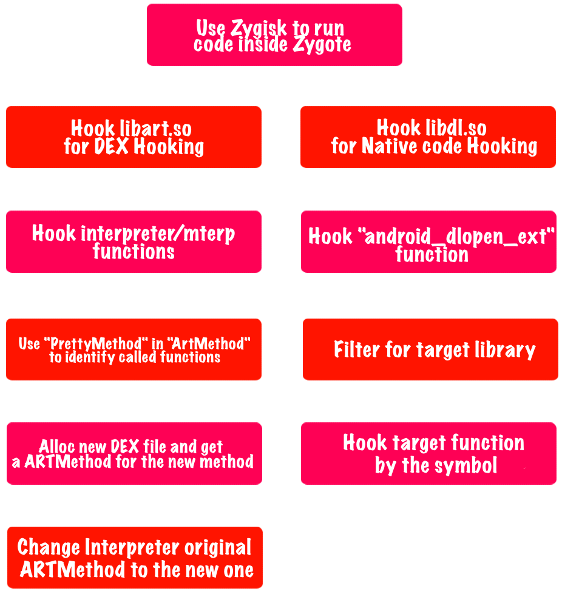
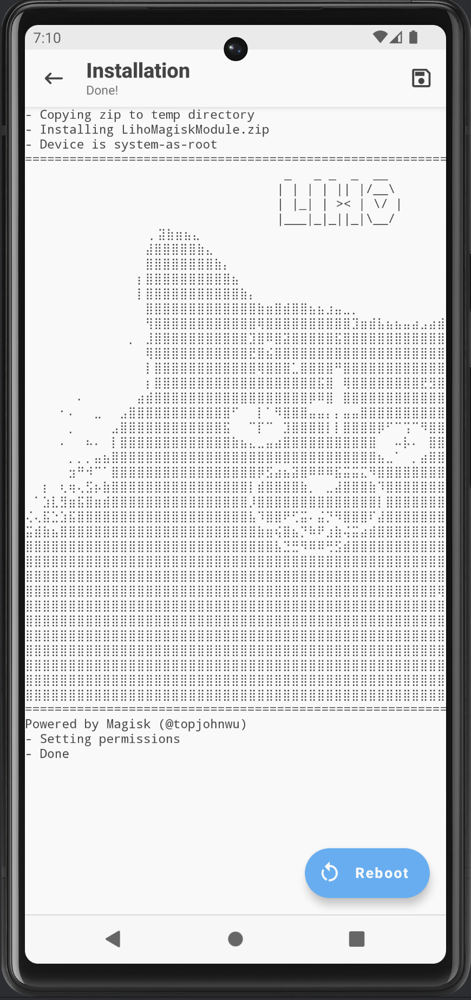
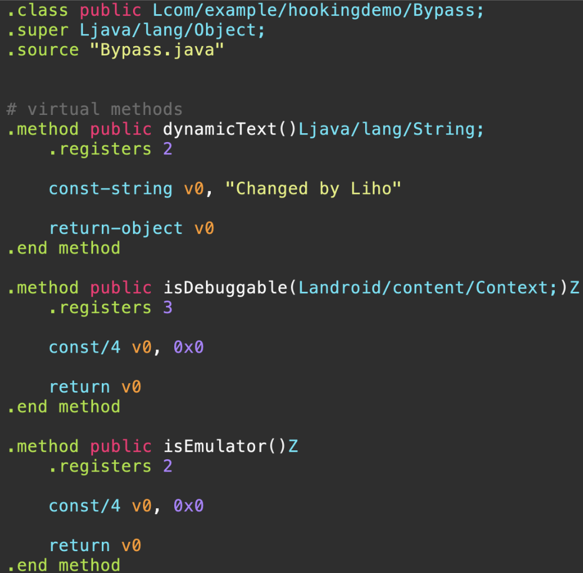
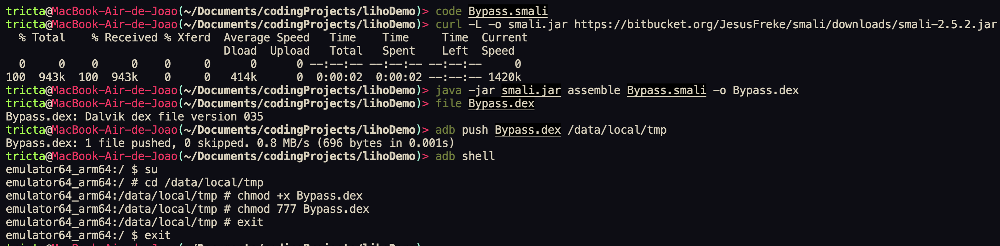
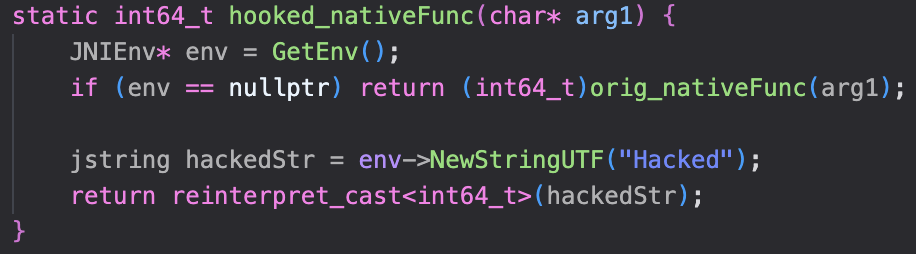

<div align="center">
  <a href="" rel="noopener">
 </a>
</div>

<div align="center">

[]()
[](https://github.com/Tricta/Liho/issues)
[](https://github.com/Tricta/Liho/pulls)
[](/LICENSE)

</div>

---

<p align="center"> Hooking tool for libart.so and libdl.so, enabling instrumentation of both DEX and native code on Android.
    <br> 
</p>

## 📝 Table of Contents

- [About](#about)
- [Prerequisites](#prerequisites)
- [Installing](#installing)
- [Usage](#usage)
- [Built Using](#built_using)
- [TODO](../TODO.md)
- [Acknowledgments](#acknowledgement)

## 🧐 About <a name = "about"></a>

Liho hooks Android system components like libart.so and libdl.so to enable instrumentation of both DEX and native code of applications via zygote injection.

This approach stealthily bypasses Frida, Xposed and debugger detections, traces method calls during app forks via ShadowFrames and ArtMethods, and help to quick reversing and bypass protections.

Liho intercepts every ART entry point (`DoCall`, `artQuickToInterpreterBridge`, `ArtMethod::Invoke`) and prints a `ShadowFrame` call tree on each `DoCall`, so every DEX method executed by the target is logged without needing a specific hook target. Native hooks support both **inline** (Dobby) and **PLT** (xhook) strategies.

You can see the overall flow in the diagram below:

<div align="center">
  
</div>

## ⚙️ Prerequisites

The project currently works only on ARM, ARM64, x86 and x86_64 devices

Dobby and xHook are pulled in as git submodules, so clone with submodules (or init them after cloning):
```
git clone --recurse-submodules <repo-url>
# or, if already cloned:
git submodule update --init --recursive
```

To build the module, run one of the setup scripts included in the project:
```
./setup arm64
adb push LihoMagiskModule.zip /sdcard/Download
```

## 📦 Installing

Having a mobile with a Root Manager and Zygisk support, you just need to install the module and reboot your system:
<div align="center">
  
</div>

## 🎈 Usage <a name="usage"></a>

For use Liho, we just need to modify the ```main.cpp``` file. First, change the apk package name on the function ```set_apk_name``` to set our target.

```
set_apk_name("com.example.dummy3");
```

Optional runtime settings:

```
set_debug_enabled(true);                            // verbose ART call-tree logs
set_log_filter("com.example.dummy3");               // only log methods matching this substring
set_dlopen_hook_method(DlopenHookMethod::PLT);      // INLINE (Dobby, default) or PLT (xhook)
```

Now, we choose to use ```register_dex_hook``` for DEX methods that are non static or ```register_native_hook``` for native methods.

On ```register_dex_hook```, you need to pass the arguments in  order:
<ol>
<li>Package.Class.targetMethod</li>
<li>NewPackage.newClass</li>
<li>New Method</li>
<li>Signature</li>
<li>DEX File to find new method</li>
</ol>

```
register_dex_hook("com.example.hookingdemo.MainActivity.dynamicText", "com.example.hookingdemo.Bypass", "dynamicText", "()Ljava/lang/String;","Bypass.dex");
```

Note: even without any `register_dex_hook`, every DEX method invoked through `DoCall` is logged as a `ShadowFrame` call tree (filtered by `set_log_filter` if set).

To generate the DEX file you can follow this steps:
<ol>
<li>
Write a .smali file as the following example with the changes we want:<br>
<div align="center">
  
</div>
</li>

<br>

<li>
Use smali.jar to compile into a DEX file and send file to <code>/data/local/tmp</code>:<br>
<div align="center">
  
</div>
</li>

<br>

On ```register_native_hook```, you need to pass the arguments in  order:
<ol>
<li>Target native lib (.so)</li>
<li>Target native method</li>
<li>A pointer to our new native method</li>
<li>A pointer to store our original native method</li>
</ol>

```
register_native_hook("libdummy3.so", "Java_com_example_dummy3_MainActivity_stringFromNativeCode", (void*)hooked_nativeFunc, (void**)&orig_nativeFunc);
```

The native hook backend is selected with `set_dlopen_hook_method`:
- `DlopenHookMethod::INLINE` — Dobby inline hook (default). Strongest, works on any exported symbol.
- `DlopenHookMethod::PLT` — xhook PLT/GOT hook. Lighter and more compatible, but only intercepts cross-library calls that go through the PLT.

You can create a new native method on this way:
<div align="center">
  
</div>

## ⛏️ Built Using <a name = "built_using"></a>

- [Magisk Modules by topjohnwu](https://topjohnwu.github.io/Magisk/guides.html)
- [Dobby by jmpews](https://github.com/jmpews/Dobby) — inline hook backend (submodule)
- [xHook by iqiyi](https://github.com/iqiyi/xHook) — PLT/GOT hook backend (submodule)

## 🎉 Acknowledgements <a name = "acknowledgement"></a>

- [Riru by RikkaApps](https://github.com/RikkaApps/Riru)
- [NbInjection by Canye](https://github.com/canyie/NbInjection?tab=readme-ov-file)
- [LSPlant by LSPosed](https://github.com/LSPosed/LSPlant)
- [Zygisk ImGui Mod Menu by reveny](https://github.com/reveny/Zygisk-ImGui-Mod-Menu)
- [YAHFA by PAGalaxyLab](https://github.com/PAGalaxyLab/YAHFA)
- [xHook by iqiyi](https://github.com/iqiyi/xHook)
- [Dobby by jmpews](https://github.com/jmpews/Dobby)
